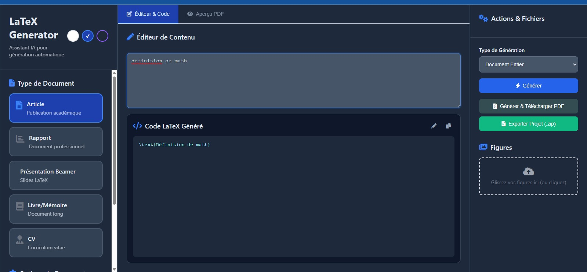

# Générateur LaTeX avec LLM  & Pipeline de Prompt-Tuning

## Vue d'ensemble

Ce projet implémente un écosystème complet démontrant l'application des Grands Modèles de Langage (LLM) pour les tâches liées à LaTeX. Le système comprend trois composants interconnectés : une application web pour la génération de code LaTeX, un pipeline de collecte de données automatisé, et un pipeline de fine-tuning de modèle utilisant la méthodologie de Prompt Tuning.

## Architecture


1. **Application Utilisateur** : Interface web FastAPI/Vue.js générant du code LaTeX à partir de descriptions en langage naturel via l'API Google Gemini
2. **Création de Dataset** : Notebook Jupyter collectant des articles LaTeX depuis arXiv et générant des descriptions textuelles via l'API Gemini, créant des datasets structurés (description, code_latex)
3. **Fine-Tuning de Modèle** : Entraînement de modèle spécialisé utilisant le Prompt Tuning (Parameter-Efficient Fine-Tuning) pour optimiser DeepSeek Coder sur les tâches de génération LaTeX


## Fonctionnalités Clés

### Fonctionnalités Principales
- **Génération LaTeX** : Génération de documents, blocs de code et formules utilisant des prompts Gemini spécialisés
- **Compilation PDF en Temps Réel** : Génération PDF directe avec gestion d'erreurs et visualisation des logs pdflatex
- **Export de Projet** : Export complet de projet au format ZIP incluant les figures
- **Pipeline de Données Automatisé** : Collecte et traitement de données arXiv
- **Fine-Tuning Efficace en Paramètres** : Implémentation Prompt Tuning entraînant seulement ~0,006% des paramètres totaux du modèle

### Spécifications Techniques
- **Backend** : FastAPI avec gestion asynchrone des requêtes
- **Frontend** : Application Vue.js Single Page
- **Architecture de Modèle** : DeepSeek-Coder-6.7B-Instruct avec paramètres gelés
- **Méthode de Fine-Tuning** : Embeddings Soft Prompt (100 tokens virtuels)
- **Efficacité d'Entraînement** : 409 600 paramètres entraînables vs 6,7B paramètres totaux

## Structure du Projet

```
├── app_fast_api.py                 # Application backend FastAPI
├── index.html                      # Interface frontend Vue.js
├── dataset_latex.json              # Dataset d'entraînement (paires description, code)
│
├── notebooks/
│   ├── 1_extraction_arxiv.ipynb    # Pipeline de collecte de données arXiv
│   └── 2_prompt_tuning.ipynb       # Pipeline d'entraînement Prompt Tuning
│
├── uploads/                        # Stockage des figures uploadées par l'utilisateur
├── requirements.txt                # Dépendances Python
├── .env.example                    # Modèle de variables d'environnement
└── README.md                       # Documentation
```

## Installation & Configuration

### Prérequis

- **Python** : Version 3.9 ou supérieure
- **Distribution LaTeX** : Installation complète avec `pdflatex` dans le PATH système
- **Exigences GPU** : GPU NVIDIA avec support CUDA et minimum 16GB VRAM (pour le fine-tuning)
- **Environnement** : Environnement virtuel recommandé

### Instructions d'Installation

1. **Configuration du Dépôt**
   ```bash
   git https://github.com/Pharaminus/generation-de-code-latex-avec-LLM
   cd generation-de-code-latex-avec-LLM
   ```

2. **Environnement Virtuel**
   ```bash
   python -m venv venv
   # Windows: venv\Scripts\activate
   # macOS/Linux: source venv/bin/activate
   ```

3. **Installation des Dépendances**
   ```bash
   pip install -r requirements.txt
   ```

4. **Configuration de l'Environnement**
   ```bash
   cp .env.example .env
   # Éditez .env avec votre clé API Google Gemini
   echo "GEMINI_API_KEY=votre_cle_api_ici" >> .env
   ```

### Dépendances

```txt
# Backend FastAPI
fastapi>=0.104.0
uvicorn[standard]>=0.24.0
python-dotenv>=1.0.0
requests>=2.31.0

# Pipeline de Données
google-generativeai>=0.3.0
feedparser>=6.0.0
tqdm>=4.66.0
jupyter>=1.0.0
pillow>=10.0.0

# Pipeline de Fine-Tuning
transformers>=4.38.0
accelerate>=0.28.0
datasets>=2.16.0
torch>=2.1.0
```

## Utilisation

### Déploiement de l'Application Web

1. **Démarrage du Serveur FastAPI**
   ```bash
   uvicorn app_fast_api:app --reload --host 0.0.0.0 --port 8000
   ```

2. **Accès à l'Interface**
   Naviguer vers `http://localhost:8000`

### Pipeline de Données & Entraînement

Exécutez les notebooks suivants en séquence en utilisant Jupyter Lab ou Kaggle/Google Colab avec support GPU :

#### Phase 1 : Collecte de Données
```bash
jupyter notebook notebooks/1_extraction_arxiv.ipynb
```
- Crée le répertoire `arxiv_data/` avec les sources LaTeX brutes
- Implémente un scraping robuste avec limitation de débit et gestion d'erreurs

#### Phase 2 : Entraînement de Modèle
```bash
jupyter notebook notebooks/2_prompt_tuning.ipynb
```
- Charge les données d'entraînement `dataset_latex.json`
- Initialise le modèle DeepSeek Coder gelé
- Entraîne les embeddings soft prompt
- Génère `soft_prompt_embeddings.pt`

## Implémentation Technique

### Architecture Backend FastAPI

Le backend implémente une conception API modulaire :

- **`/generate`** : Traite les requêtes de génération avec des prompts spécialisés pour différents types de contenu LaTeX
- **`/download-pdf`** : Exécute la compilation PDF sécurisée utilisant l'isolation subprocess
- **`/upload-figure`** : Gère les uploads de fichiers avec validation et gestion du stockage
- **`/export-zip`** : Crée des archives complètes de projet avec résolution des dépendances

### Pipeline de Collecte de Données

Le pipeline de scraping implémente des pratiques de niveau entreprise :

```python
# Composants clés
- feedparser: Parsing de flux Atom pour l'API arXiv
- requests.adapters.HTTPAdapter: Logique de retry avec backoff exponentiel
- concurrent.futures: Traitement parallèle avec limitation de débit
- tarfile: Extraction et organisation efficaces d'archives
```

### Implémentation Prompt Tuning

Le pipeline de fine-tuning suit la méthodologie de "The Power of Scale for Parameter-Efficient Prompt Tuning" :

```python
class SoftPrompt(torch.nn.Module):
    def __init__(self, prompt_length: int, hidden_size: int):
        super().__init__()
        self.embeddings = torch.nn.Parameter(
            torch.randn(prompt_length, hidden_size) * 0.1
        )
    
    def forward(self, input_embeddings):
        batch_size = input_embeddings.size(0)
        soft_prompts = self.embeddings.unsqueeze(0).expand(
            batch_size, -1, -1
        )
        return torch.cat([soft_prompts, input_embeddings], dim=1)
```

**Configuration d'Entraînement :**
- **Modèle de Base** : `deepseek-ai/deepseek-coder-6.7b-instruct`
- **Longueur de Prompt** : 100 tokens virtuels
- **Dimensions Cachées** : 4 096
- **Paramètres Entraînables** : 409 600 (0,006% du total)
- **Stratégie d'Entraînement** : Mises à jour de gradient uniquement sur les embeddings soft prompt

## Dépannage

### Problèmes Courants

**Erreurs de Compilation PDF**
- Vérifiez l'installation de la distribution LaTeX
- Confirmez la disponibilité de `pdflatex` dans le PATH système
- Consultez les logs de compilation dans l'onglet "Aperçu PDF"

**Erreurs de Mémoire (OOM)**
- Réduisez `BATCH_SIZE` dans la configuration d'entraînement
- Diminuez le paramètre `MAX_SEQ_LENGTH`
- Assurez-vous d'avoir suffisamment de mémoire GPU (minimum 16GB VRAM)

**Erreurs de Parsing JSON**
- Validez la syntaxe JSON dans les fichiers de dataset
- Vérifiez les virgules manquantes entre objets
- Utilisez des validateurs JSON pour les gros datasets

**Limitation de Débit API**
- Implémentez un backoff exponentiel dans les requêtes
- Surveillez le quota et les limites de l'API Gemini
- Ajoutez des délais entre les appels API consécutifs

## Feuille de Route de Développement

### Améliorations Immédiates
- **Intégration Soft Prompt** : Incorporer les embeddings entraînés dans l'application FastAPI
- **Streaming de Réponse** : Implémenter un feedback de génération en temps réel pour les documents longs
- **Support BibTeX** : Ajouter la gestion de bibliographie et le pipeline de compilation

### Améliorations d'Infrastructure
- **Conteneurisation** : Déploiement Docker avec dépendances LaTeX
- **Monitoring** : Suivi des performances d'application et d'utilisation d'API
- **Pipeline CI/CD** : Tests automatisés et workflows de déploiement

### Fonctionnalités Avancées
- **Support Multi-Modèles** : Intégration de modèles spécialisés additionnels
- **Gestion de Templates** : Bibliothèque de templates LaTeX et personnalisation
- **Fonctionnalités Collaboratives** : Partage de projets multi-utilisateurs et contrôle de version

## Métriques de Performance

### Efficacité d'Entraînement
- **Réduction de Paramètres** : 99,994% de réduction des paramètres entraînables
- **Utilisation Mémoire** : ~8GB mémoire GPU pendant l'entraînement
- **Temps d'Entraînement** : ~2 heures sur GPU T4 pour 100 époques

### Performance d'Application
- **Temps de Réponse** : <2 secondes pour la génération LaTeX standard
- **Compilation PDF** : <5 secondes pour les documents typiques
- **Utilisateurs Simultanés** : Support de 10+ sessions simultanées

## Licence

Ce projet est sous licence MIT.


